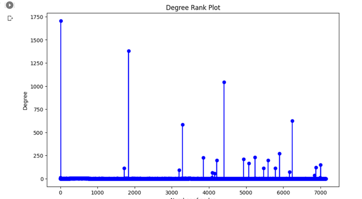
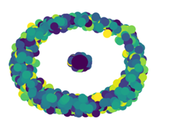

# Top Ten universities authors Network Analysis
### By students: 
Omnia Nabil Gharieb	120200156  
Hanin Mohamed Saleh	120190074  
Hussein Ahmed Hussein	120200261  
### with Prof. Walid Gomaa

## Abstract
Network analysis is a field of study that focuses on the analysis of networks, which are collections of interconnected objects or entities. Networks can be found in many domains, including social networks, transportation networks, biological networks, and information networks. Network analysis provides a set of tools and techniques for visualizing, modeling, and analyzing networks to understand their structure, dynamics, and behavior.
[The Data File](https://drive.google.com/drive/folders/12OIR9NY02QQmRzZ2XjhTCjGh-IfbEGAD?usp=share_link) 

## I. Introduction
### Background Information:
The problem of Top Ten Universities Authors Network Analysis involves analyzing the co-authorship patterns of researchers from the top ten universities in a particular field. The goal of this analysis is to gain insights into the collaborative networks and research trends within the field.
 
The first step in this analysis is to collecting our data by identifying the top ten universities in the field, either by their overall ranking or by their reputation in the specific area of research. Next, the publications from researchers affiliated with these universities are gathered, and the co-authors of these publications are identified. This information is used to construct a network of co-authorship, in which nodes represent researchers and edges represent co-authorship relationships between them.
 
Once the network is constructed, a number of measures can be calculated to gain insights into the structure and dynamics of the network. For example, centrality measures such as degree centrality, betweenness centrality, and eigenvector centrality can be used to identify the most important researchers in the network and the key brokers of information flow. Community detection algorithms can be used to identify groups of researchers who collaborate closely with each other, and to explore the research topics and themes that are most prominent within these groups.
 
Other measures that can be calculated include clustering coefficients, which provide information about the density and connectedness of the network. By analyzing this measure, researchers can gain insights into the collaborative patterns and research trends within the field.
 
Overall, the problem of Top-Ten Universities Authors Network Analysis is an important one in the field of bibliometrics and scient metrics, as it allows researchers to better understand the structure and dynamics of collaborative networks within a particular field. By analyzing the co-authorship patterns of researchers from the top universities in the field, researchers can gain insights into the most influential researchers, the most important research topics and themes, and the key collaborations and partnerships within the field. This information can be used to guide future research, identify potential collaborators, and inform policy decisions related to research funding and investment.
 

## II.	IDENTIFY, RESEARCH AND COLLECT IDEA
### Steps of collecting data (our data set):
1.	Define the research question: Before creating the dataset, you should define the research question or objective that the dataset will address. For example, you may want to analyze the co-authorship patterns and citation networks of researchers from the top ten universities in a particular field.  
2.	Determine the data sources: Once you have defined the research question, you need to identify the sources of data that will provide the information you need. These sources may include academic databases such as Web of Science or Scopus, as well as university websites or departmental pages.  
3.	Collect the data: Depending on the sources of data, you may need to collect data on the publications and authors affiliated with the top ten universities in the field. This may involve conducting searches using specific keywords or subject areas, and filtering the results to identify the top publications and authors.  
4.	Clean the data: After collecting the data, you need to clean it by removing any errors, inconsistencies, or missing values. This may involve checking for duplicates, ensuring that the data is in the correct format, and dealing with missing data.  
5.	Organize the data: Once the data is cleaned, you need to organize it into a format that is suitable for analysis. This may involve structuring the data into tables or spreadsheets, and assigning labels or codes to the data.  

### Data Analysis:
#### First: Graph
It’s a type of data analysis that focuses on studying the relationships between entities. It involves using mathematical and statistical methods to analyze the structure and properties of graphs or networks, where nodes represent entities and edges represent relationships between them. Our Nodes was authors and referenced authors and edges was the co-authority. We used graph. degree function in networkx.  

#### Second: Degree Distribution
Degree distribution analysis is a method of graph analysis that focuses on studying the distribution of node degrees in a network. Node degree is defined as the number of edges connected to a node in the network. Degree distribution analysis involves calculating the frequency of nodes with each possible degree and visualizing the resulting distribution.  

#### Third: Connected component analysis
Connected component analysis is a method used in network analysis to understand the structure and connectivity of a network by identifying its connected components. It is a subset of nodes in a network where each node is connected to at least one other node in the same subset. In other words, all nodes in a connected component can be reached from any other node in the same component by following a path of connected nodes. By analyzing the connected components of a network, we can gain insights into its overall structure and organization. For example, a network with many small connected components and a few large ones might indicate a hierarchical or modular organization. On the other hand, a network with a single large connected component might indicate a highly connected and cohesive network.  

#### Fourth: clustering
In network analysis, clustering refers to the identification of groups of nodes that are densely connected to each other within a network. These groups are often referred to as clusters or communities. Clustering is a useful concept because it allows us to identify substructures within a network that have similar properties or functions.  We used Modularity-based methods: This approach involves optimizing a quality function called modularity that measures the strength of the division of the network into communities. Modularity-based algorithms aim to maximize the modularity.  

## III.	WRITE DOWN YOUR STUDIES AND FINDINGS
Our results were that:
•	we could identify the key author (the most central and influential authors in the network) based on measures such as degree centrality, betweenness centrality, and eigenvector centrality. He was daniela bortoletto as he had the highest degree which is 1750.
  
•	Identification of research clusters: Network analysis could identify groups or clusters of authors who are more tightly connected to each other than to the rest of the network. These clusters may represent research subfields or areas of specialization within the network.
  

## IV.	CONCLUSION
Overall, the results of a network analysis of top ten universities authors could have important implications for research, policy, and decision-making in the field. By understanding the structure and properties of the network, researchers and practitioners can identify areas of collaboration, innovation, and potential disruption, and use this information to inform their work and future research directions.  

### Connected Components Analysis
Analyze the connected components in the citation network. Identify the size and number of connected components. Discuss the presence of any isolated components or sub-networks within the larger network.  

## REFERENCES
[1]	G. O. Young, “Synthetic structure of industrial plastics (Book style with paper title and editor),” 	in Plastics, 2nd ed. vol. 3, J. Peters, Ed.  New York: McGraw-Hill, 1964, pp. 15–64.
[2]	W.-K. Chen, Linear Networks and Systems (Book style).	Belmont, CA: Wadsworth, 1993, pp. 123–135.
[3]	H. Poor, An Introduction to Signal Detection and Estimation.   New York: Springer-Verlag, 1985, ch. 4.
[4]	B. Smith, “An approach to graphs of linear forms (Unpublished work style),” unpublished.
[5]	E. H. Miller, “A note on reflector arrays (Periodical style—Accepted for publication),” IEEE Trans. Antennas Propagat., to be published.
[6]	J. Wang, “Fundamentals of erbium-doped fiber amplifiers arrays (Periodical style—Submitted for publication),” IEEE J. Quantum Electron., submitted for publication.
